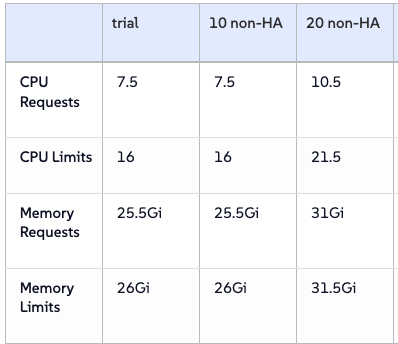

# Readme

Status:  Work In Progress (not working, yet)

Purpose: Install SUSE Observability (aka/fka StackState) 

You will find the [Scripts](./Scripts) to execute in order to deploy O11y.

Note:
I ended up having to build a 3-node K3s Cluster with 4 vCPU, 16GB, 300GB - otherwise, I was unable to get Observability installed/running.  I plan to revisit this at some point to see where that "line" exists for minimal resource requirements, but... after it was up and running, it was consuming quite a large chunk of memory on each node.

```
geeko:.kube jradtke$ k top nodes
NAME               CPU(cores)   CPU(%)   MEMORY(bytes)   MEMORY(%)
observability-01   213m         5%       7683Mi          48%
observability-02   206m         5%       8325Mi          52%
observability-03   102m         2%       7528Mi          47%
```
23.5 GB of memory!!!  Meh, I say - but still.



[Source: https://documentation.suse.com/cloudnative/suse-observability/latest/en/setup/install-stackstate/requirements.html]

The reqs are reasonable considering the product is running: 
Kafka, OTel, Hbase, Clickhouse, Elasticsearch, Prometheus, etc...

